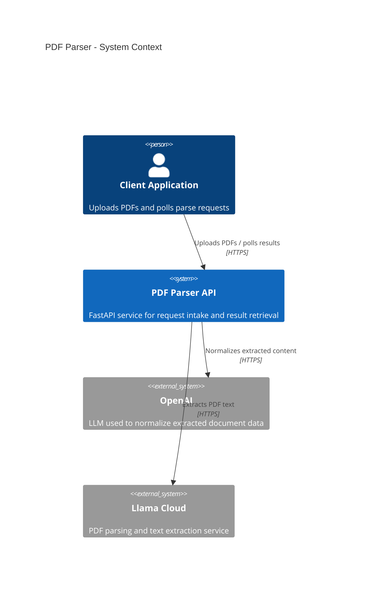
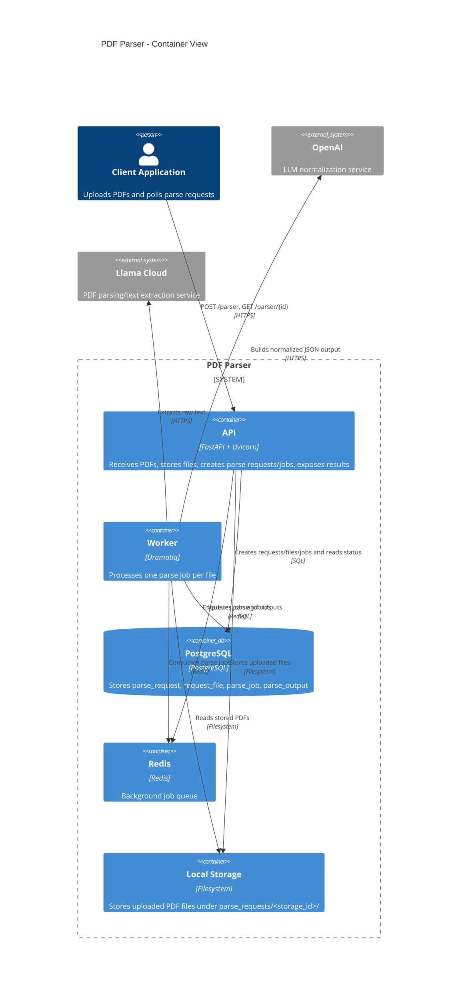

# Architecture C4

## System Context

```mermaid
C4Context
    title PDF Parser - System Context

    Person(client, "Client Application", "Uploads PDFs and polls parse requests")

    System(api, "PDF Parser API", "FastAPI service for request intake and result retrieval")
    System_Ext(openai, "OpenAI", "LLM used to normalize extracted document data")
    System_Ext(llama, "Llama Cloud", "PDF parsing and text extraction service")

    Rel(client, api, "Uploads PDFs / polls results", "HTTPS")
    Rel(api, llama, "Extracts PDF text", "HTTPS")
    Rel(api, openai, "Normalizes extracted content", "HTTPS")
```

## Container View

```mermaid
C4Container
    title PDF Parser - Container View

    Person(client, "Client Application", "Uploads PDFs and polls parse requests")

    System_Boundary(pdf_parser, "PDF Parser") {
        Container(api, "API", "FastAPI + Uvicorn", "Receives PDFs, stores files, creates parse requests/jobs, exposes results")
        Container(worker, "Worker", "Dramatiq", "Processes one parse job per file")
        ContainerDb(db, "PostgreSQL", "PostgreSQL", "Stores parse_request, request_file, parse_job, parse_output")
        Container(queue, "Redis", "Redis", "Background job queue")
        Container(storage, "Local Storage", "Filesystem", "Stores uploaded PDF files under parse_requests/<storage_id>/")
    }

    System_Ext(openai, "OpenAI", "LLM normalization service")
    System_Ext(llama, "Llama Cloud", "PDF parsing/text extraction service")

    Rel(client, api, "POST /parser, GET /parser/{id}", "HTTPS")
    Rel(api, storage, "Stores uploaded files", "Filesystem")
    Rel(api, db, "Creates requests/files/jobs and reads status", "SQL")
    Rel(api, queue, "Enqueues parse_job ids", "Redis")

    Rel(worker, queue, "Consumes parse jobs", "Redis")
    Rel(worker, db, "Updates jobs and outputs", "SQL")
    Rel(worker, storage, "Reads stored PDFs", "Filesystem")
    Rel(worker, llama, "Extracts raw text", "HTTPS")
    Rel(worker, openai, "Builds normalized JSON output", "HTTPS")
```
