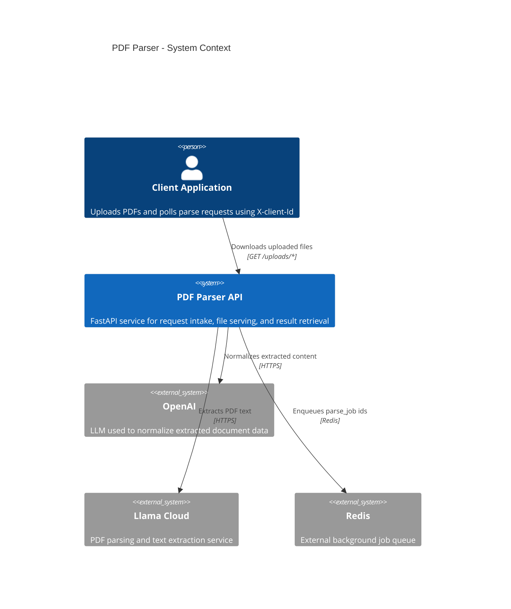
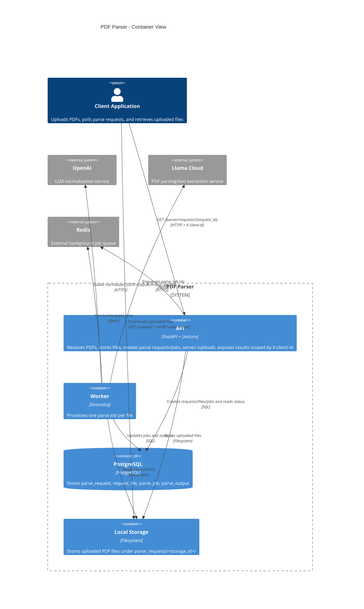

# Architecture C4

## System Context

## Container View

## Notes

- `parse_request` is scoped by `anon_id`, passed through the `X-client-Id` header.
- Uploaded files are stored on disk and served publicly through `/uploads`.
- `parse_request` creates one `request_file` and one `parse_job` per uploaded file.
- The worker processes one `parse_job` at a time and persists the final `parse_output`.
- PostgreSQL is part of the local Docker stack; Redis is currently expected as an external service via `REDIS_URL`.
